## Introduction ##
Elasticsearch is an open-source Lucene-based search engine developed by [elastic](https://elastic.co). With principal features like scalability, resiliency, and top-notch performance, Elasticsearch is so interesting that it is used by Mozilla, Facebook, GitHub, Netflix, eBay, New York Times, and many more.
Elasticsearch is one of the most popular analytics platform for large datasets being present almost everywhere where a search engine is involved. It uses a document-oriented approach when manipulating data, being able to parse it in almost real time to search. Data is stored in JSON format and can be organized based on the index and types. A simple comparison between Elasticsearch and a relational database would look like this:

MySQL > Databases  > Tables >  Columns/Rows

Elasticsearch  > Indices >  Types  >  Documents with properties

**Advantages of Elasticsearch:**
- built on top of Lucene – being built on top of Lucene, it provides the most powerful full-text search capabilities of any open source product.
- document-oriented – it stores real world complex entities as structured JSON documents and indexes all fields by default, providing a higher performance.
- schema free – it stores a large quantity of semi-structured (JSON) data in a distributed fashion.
- full text search – it performs linguistic searches against documents and returns the documents that matches the search condition. Result relevancy for the given query is calculated using TF/IDF algorithm.
- fuzzy searching - good for spelling errors letting you find what you are searching for even though you have a spelling mistake.
- autocompletion - Searching while the user types.
- RESTFUL API – Elasticsearch supports REST API which is light-weight protocol. 
- speed - Elasticsearch is able to execute complex queries extremely fast. It also caches queries so for every other request which contains a cached filter, it checks and serves the result from cache.
- scalability - can easily scale horizontally providing the ability to extend resources and balance the loading between the nodes in a cluster.
- distributed approach - indices can be divided into shards, with each shard able to have any number of replicas.

**Terminologies:**
- cluster: collection of nodes that work together.
- node: single server that is part of the cluster, stores the data, and participates in the cluster’s indexing and search capabilities.
- index: collection of documents with similar characteristics.
- type: one index can have multiple types, similar to  multiple tables of a relational database.
- document: basic unit of information that can be indexed.
- shards: indexes are divided into multiple pieces called shards, which allows the index to scale horizontally.
- replicas: copies of index shards

## Prerequisites
To perform this demo you will need the following:
- a Google Cloud Platform account, the free tier provided is more than enough (any other cloud should work the same)
- [Rancher](https://rancher.com) v2.0.8
- Kubernetes cluster running on Google Kubernetes Engine version 1.10.7-gke.2 (running EKS or AKS should be the same)

## Starting a Rancher 2.0 instance
To begin, start a Rancher 2.0 instance. There is a very intuitive getting started guide for this purpose [here](https://rancher.com/quick-start/).

## Using Rancher to deploy a GKE cluster
Use Rancher to set up and configure your Kubernetes cluster, follow the how-to [guide](https://rancher.com/docs/rancher/v2.x/en/cluster-provisioning/hosted-kubernetes-clusters/gke/).

## Deploying Elasticsearch

1. If you are familiar with `kubectl` command just run the following:

svc-cluster.yaml:
```yaml
apiVersion: v1
kind: Service
metadata:
  name: elasticsearch-cluster
spec:
  clusterIP: None
  selector:
    app: es-cluster
  ports:
  - name: transport
    port: 9300
```

```bash
$ kubectl apply -f svc-cluster.yaml 
service/elasticsearch-cluster created
```

svc-loadbalancer.yaml:
```yaml
apiVersion: v1
kind: Service
metadata:
  name: elasticsearch-loadbalancer
spec:
  selector:
    app: es-cluster
  ports:
  - name: http
    port: 80
    targetPort: 9200
  type: LoadBalancer
```

```bash
$ kubectl apply -f svc-loadbalancer.yaml 
service/elasticsearch-loadbalancer created
```

es-sts-deployment.yaml:
```yaml
apiVersion: v1
kind: ConfigMap
metadata:
  name: es-config
data:
  elasticsearch.yml: |
    cluster.name: my-elastic-cluster
    network.host: "0.0.0.0"
    bootstrap.memory_lock: false
    discovery.zen.ping.unicast.hosts: elasticsearch-cluster
    discovery.zen.minimum_master_nodes: 1
    xpack.security.enabled: false
    xpack.monitoring.enabled: false
  ES_JAVA_OPTS: -Xms512m -Xmx512m
---
apiVersion: apps/v1beta1
kind: StatefulSet
metadata:
  name: esnode
spec:
  serviceName: elasticsearch
  replicas: 2
  updateStrategy:
    type: RollingUpdate
  template:
    metadata:
      labels:
        app: es-cluster
    spec:
      securityContext:
        fsGroup: 1000
      initContainers:
      - name: init-sysctl
        image: busybox
        imagePullPolicy: IfNotPresent
        securityContext:
          privileged: true
        command: ["sysctl", "-w", "vm.max_map_count=262144"]
      containers:
      - name: elasticsearch
        resources:
            requests:
                memory: 1Gi
        securityContext:
          privileged: true
          runAsUser: 1000
          capabilities:
            add:
            - IPC_LOCK
            - SYS_RESOURCE
        image: docker.elastic.co/elasticsearch/elasticsearch:6.5.0
        env:
        - name: ES_JAVA_OPTS
          valueFrom:
              configMapKeyRef:
                  name: es-config
                  key: ES_JAVA_OPTS
        readinessProbe:
          httpGet:
            scheme: HTTP
            path: /_cluster/health?local=true
            port: 9200
          initialDelaySeconds: 5
        ports:
        - containerPort: 9200
          name: es-http
        - containerPort: 9300
          name: es-transport
        volumeMounts:
        - name: es-data
          mountPath: /usr/share/elasticsearch/data
        - name: elasticsearch-config
          mountPath: /usr/share/elasticsearch/config/elasticsearch.yml
          subPath: elasticsearch.yml
      volumes:
        - name: elasticsearch-config
          configMap:
            name: es-config
            items:
              - key: elasticsearch.yml
                path: elasticsearch.yml
  volumeClaimTemplates:
  - metadata:
      name: es-data
    spec:
      accessModes: [ "ReadWriteOnce" ]
      resources:
        requests:
          storage: 5Gi
```

```bash
$ kubectl apply -f es-sts-deployment.yaml 
configmap/es-config created
statefulset.apps/esnode created
```

2. Or deploy Services and Workloads from Rancher's UI

Check the below screenshots, you will just need to import the yaml files stored locally. Similar with the use of `kubelet` command we will start creating the Services first by importing the associated yaml files. We will create one Service used for internal communication inside elasticsearch cluster and one Service used to access elasticsearch endpoint from the Internet. Lastly, we will deploy the Workload containing the two elasticsearch nodes. We will wait for these to turn green, then we will check the corresponding  volumes created for each.

Importing svc-cluster.yaml:
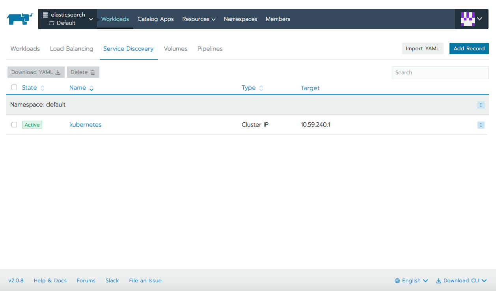
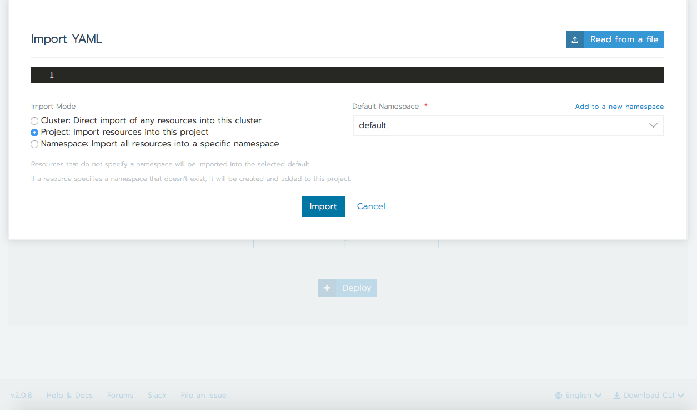
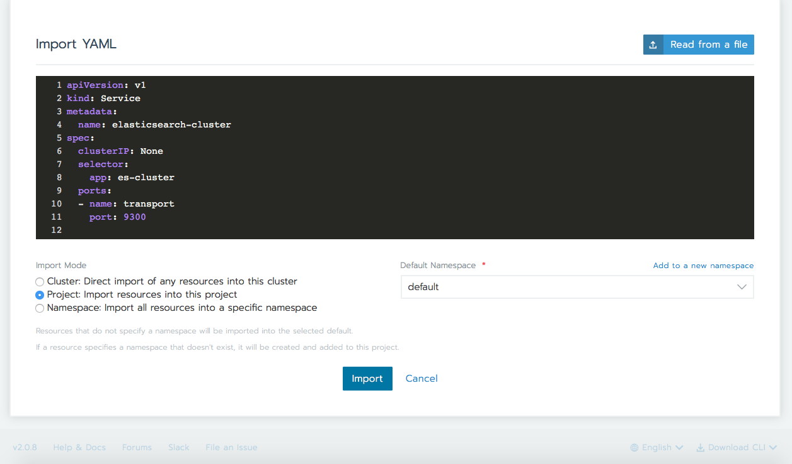
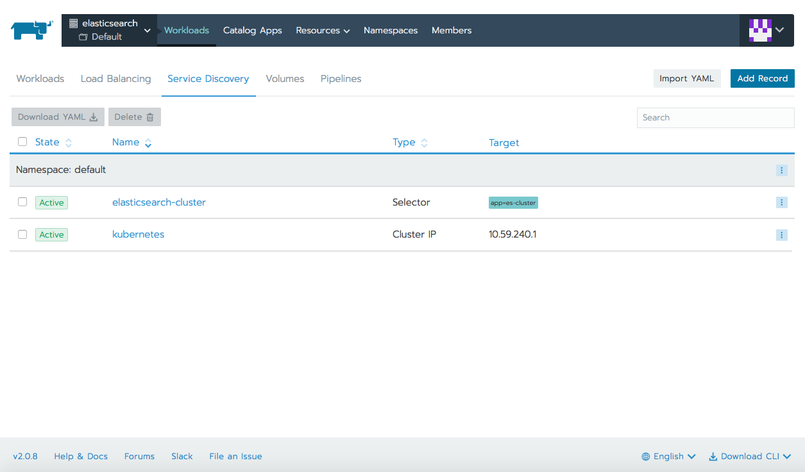
Importing svc-loadbalancer.yaml:
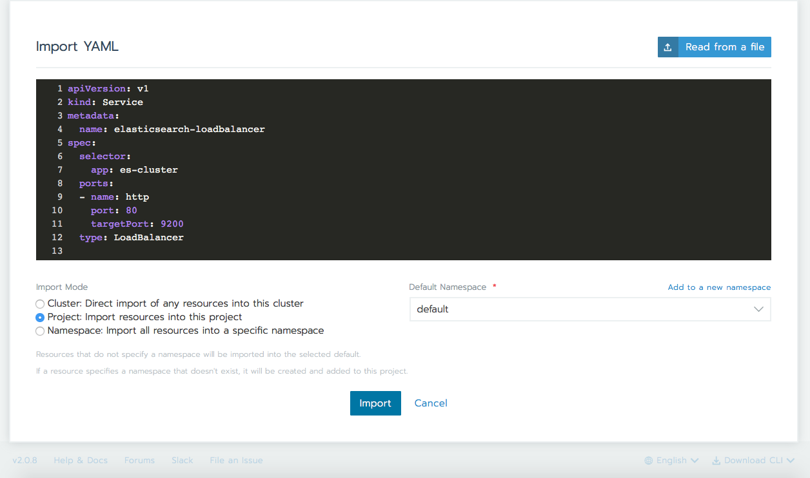
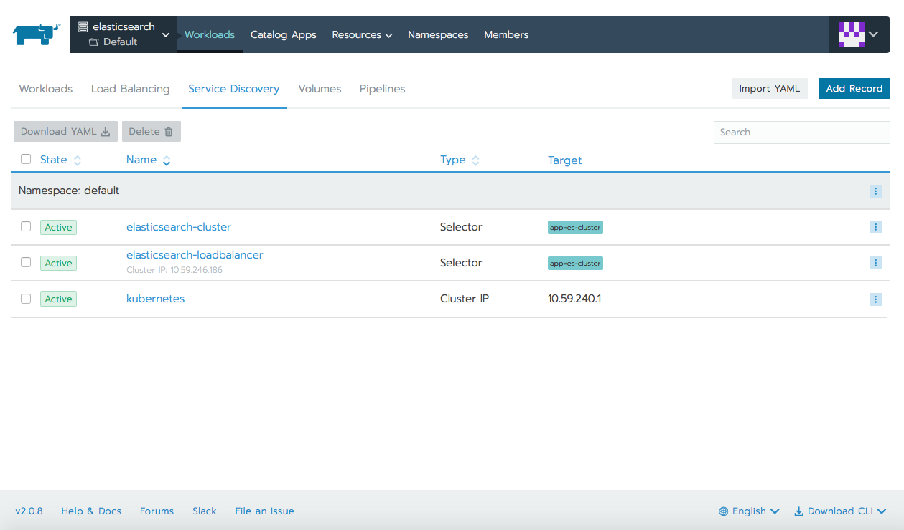
Importing es-sts-deployment.yaml:
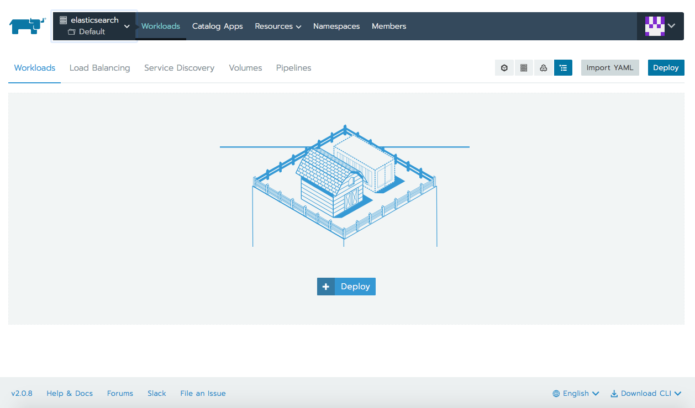
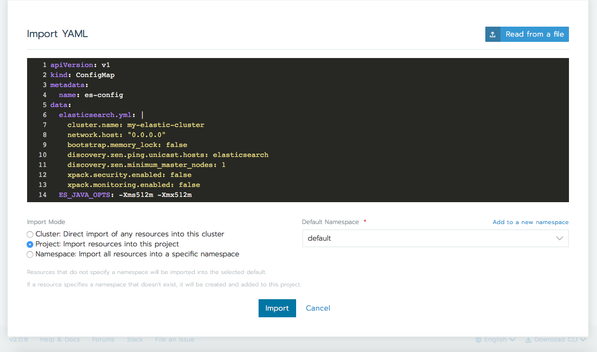
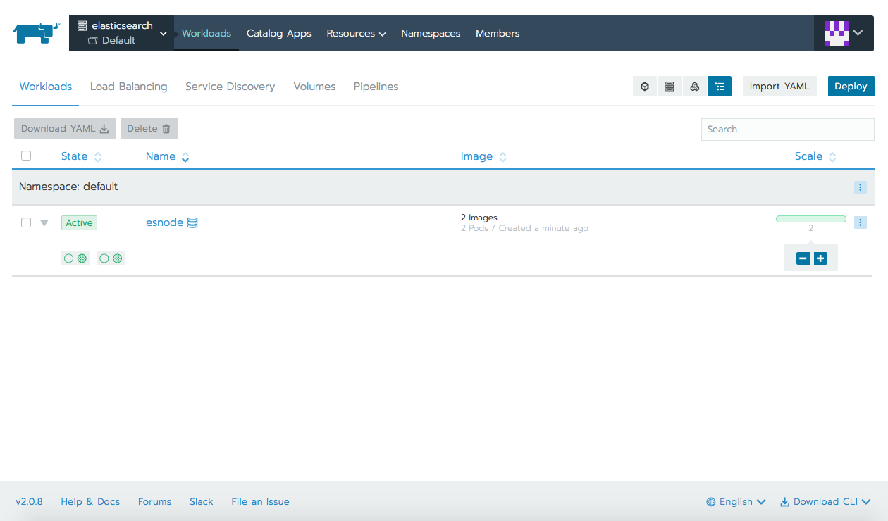
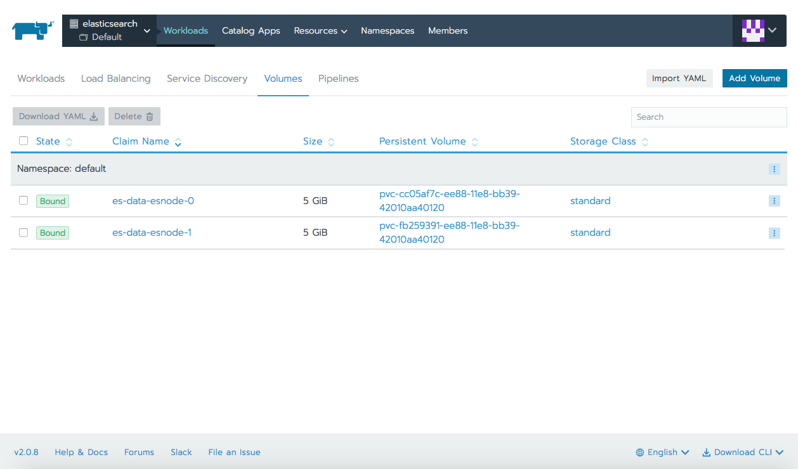
Getting the public IP:
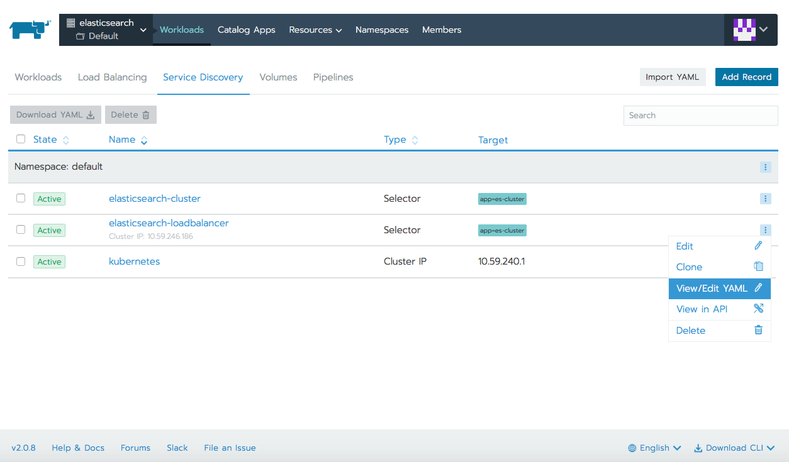

Same IP address can be obtained with the command:

```bash
$ kubectl get svc elasticsearch-loadbalancer
NAME                         TYPE           CLUSTER-IP      EXTERNAL-IP      PORT(S)        AGE
elasticsearch-loadbalancer   LoadBalancer   10.59.246.186   35.204.239.246   80:30604/TCP   33m
```

## Trying and testing Elasticsearch

Having the external IP address  (LoadBalancer Ingress) we can now test elasticsearch API.

Basic details:
```bash
$ curl 35.204.239.246
{
  "name" : "d7bDQcH",
  "cluster_name" : "my-elastic-cluster",
  "cluster_uuid" : "e3JVAkPQTCWxg2vA3Xywgg",
  "version" : {
    "number" : "6.5.0",
    "build_flavor" : "default",
    "build_type" : "tar",
    "build_hash" : "816e6f6",
    "build_date" : "2018-11-09T18:58:36.352602Z",
    "build_snapshot" : false,
    "lucene_version" : "7.5.0",
    "minimum_wire_compatibility_version" : "5.6.0",
    "minimum_index_compatibility_version" : "5.0.0"
  },
  "tagline" : "You Know, for Search"
}
```

Check cluster nodes (see the `*` which is showing as the master):
```bash
$ curl 35.204.239.246/_cat/nodes?v
ip        heap.percent ram.percent cpu load_1m load_5m load_15m node.role master name
10.56.2.8           24          97   5    0.05    0.12     0.13 mdi       -      d7bDQcH
10.56.0.6           28          96   4    0.01    0.05     0.04 mdi       *      WEOeEqC
```

Check indices:
```bash
$ curl 35.204.239.246/_cat/indices?v
health status index uuid pri rep docs.count docs.deleted store.size pri.store.size
```

As this is a fresh instance, there are no indices created and there is no data stored. Let's ingest some sample data which we can analyze after. We will use three json files, these are taken from elastic [site](https://www.elastic.co/guide/en/kibana/current/tutorial-load-dataset.html).

```bash
$ curl -H 'Content-Type: application/x-ndjson' -XPOST 'http://35.204.239.246/shakespeare/doc/_bulk?pretty' --data-binary @shakespeare_6.0.json
$ curl -H 'Content-Type: application/x-ndjson' -XPOST 'http://35.204.239.246/bank/account/_bulk?pretty' --data-binary @accounts.json 
$ curl -H 'Content-Type: application/x-ndjson' -XPOST 'http://35.204.239.246/_bulk?pretty' --data-binary @logs.jsonl 
```

We have now five indexes created:
```bash
$ curl 35.204.239.246/_cat/indices?v
health status index               uuid                   pri rep docs.count docs.deleted store.size pri.store.size
green  open   logstash-2015.05.20 MFdWJxnsTISH0Z9Vr0aT3g   5   1       4750            0     49.9mb         25.2mb
green  open   logstash-2015.05.18 lLHV2nzvTOG9mzlpKaG9sg   5   1       4631            0     46.5mb         23.5mb
green  open   logstash-2015.05.19 PqNnVUgXTyaDSfmCQZwbLQ   5   1       4624            0     48.2mb         24.2mb
green  open   shakespeare         rwl3xBgmQtm8B3V7GFeTZQ   5   1     111396            0       46mb         23.1mb
green  open   bank                z0wVGsbrSiG2cQwRXwaCOg   5   1       1000            0    949.2kb        474.6kb
```


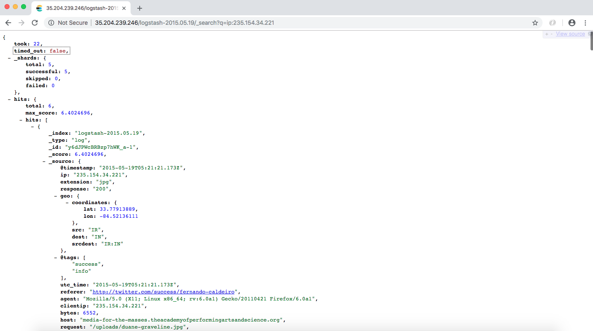


## Conclusion
Elasticsearch is extremely powerful, being both, a simple and complex product. We've seen the basics of what it is, how it can be deployed (with [Rancher's](https://rancher.com) help) and how to work with it using some REST APIs. We've looked at some use cases as logging/log analysis, combining public data, full text search or visualize data. Hopefully you now have a better understanding of what Elasticsearch is and if you enjoyed this tutorial, feel free to further experiment the rest of its great features! 
